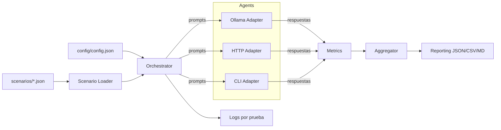

# Sistema de Testing Avanzado para LLMs Locales

Este paquete crea un entorno aislado para evaluar de forma profesional múltiples modelos/agents LLM locales bajo escenarios controlados, con medición cuantitativa, cualitativa y calificativa.

Objetivos clave:
- Orquestación de pruebas de principio a fin por agente, escenario e iteración (≥ 10 por agente).
- Métricas cuantitativas: latencia (p50/p95), throughput, longitud de respuesta, variabilidad entre iteraciones, errores.
- Métricas cualitativas: cobertura de keywords requeridas/prohibidas, formato, cumplimiento de instrucciones, coherencia básica.
- Métricas calificativas: scoring ponderado por rúbricas (exactitud, completitud, relevancia, claridad, estilo, penalización por tiempo excedido).
- Logging por test con convención: <agentName>__<timestamp>__iter-<N>.log
- Reportes agregados por agente y por escenario en JSON/CSV/Markdown.
- Adaptadores de agente: Ollama (HTTP), HTTP genérico, CLI local. Extensible.

Estructura
- config/ → configuración principal y ejemplos
- scenarios/ → escenarios de prueba (JSON) con entradas y verdades-objetivo
- src/core → orquestación, ejecución, logging, carga de escenarios
- src/agents → interfaces y adaptadores de agentes
- src/metrics → cálculo de métricas y rúbricas
- src/reporting → agregación y exportación de reportes
- logs/ → archivos de log por test
- reports/ → reportes agregados

Diagrama general (Mermaid)

Quick start (Python 3.10+)
1) Ajusta config/config.json (agentes, iteraciones, timeouts, etc.)
2) Añade/modifica escenarios en scenarios/*.json
3) Ejecuta: `python run_tests.py`
4) Revisa `logs/` y `reports/`

Requisitos
- Solo usa librerías estándar por defecto (urllib, json, time, concurrent.futures). Opcionalmente puedes instalar librerías para métricas avanzadas, pero el sistema funciona sin dependencias externas.

Notas de diseño
- Transparencia: Cada prueba genera un log independiente con parámetros, tiempos, respuesta y métricas por iteración.
- Reproducibilidad: Se permite fijar parámetros del agente (por ejemplo temperatura) si el backend lo soporta.
- Extensibilidad: Añade nuevos adaptadores implementando BaseAgent en src/agents/base.py.
- Robustez: Manejo de timeouts y captura de errores por iteración para no detener campañas completas.

